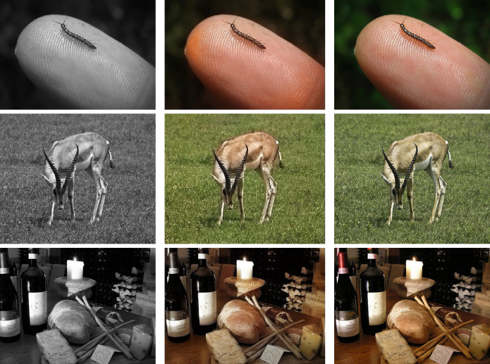

# Image-Colorizer

A neural network coded in PyTorch to color a black and white image. The neural network is an encoder-decoder which allows for variable sizes of input images and is benefitial when the number of outputs is greater than the number of inputs. 

The grayscale image has a single channel explaining the brightness of each pixel. To properly define a colored image we require 3 channels. 

For this exercise the color-space "LAB" is utilized. The L channel is similar to the grayscale channel, leaving the task at hand to simply produce two other channels representing the A and B channel. Since the task is reduced from producing three channels to producing two channels, the number of parameters in the model are reduced significantly and the training more efficient. 

The train notebook explains the training process and the test notebook loads the model weights and tests the model on a sample test set. 

Since the model requires to produce more information than present, heavy computation costs are involved including a significant training time. With the limited resources available, a sample output of the model is attached below. 

